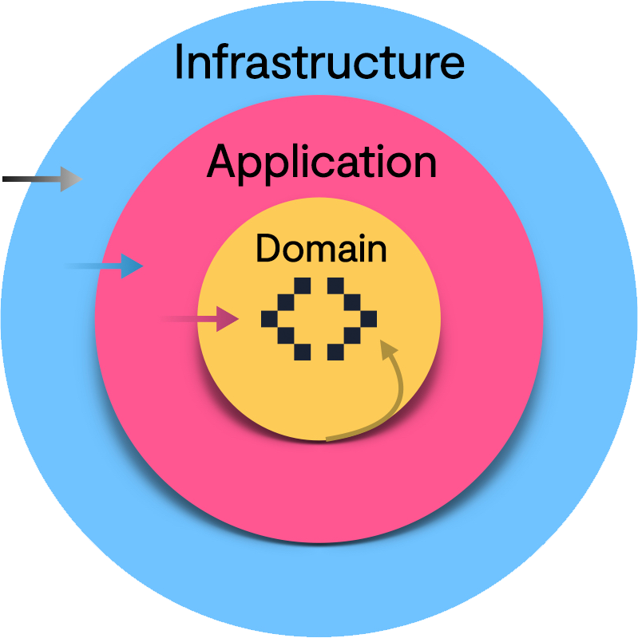

**Infraestructura**

    Tot allò que sigui tecnologia o que sigui d'entrada o sortida: Bases de dades, APIs, MatplotLib, Bokeh, etc.

**Aplicació**

    On s'implementen els casos d'ús: CrearUsuari, ObtenirUsuaris, ...

**Domini**

    On hi ha les entitats i la lògica de negoci