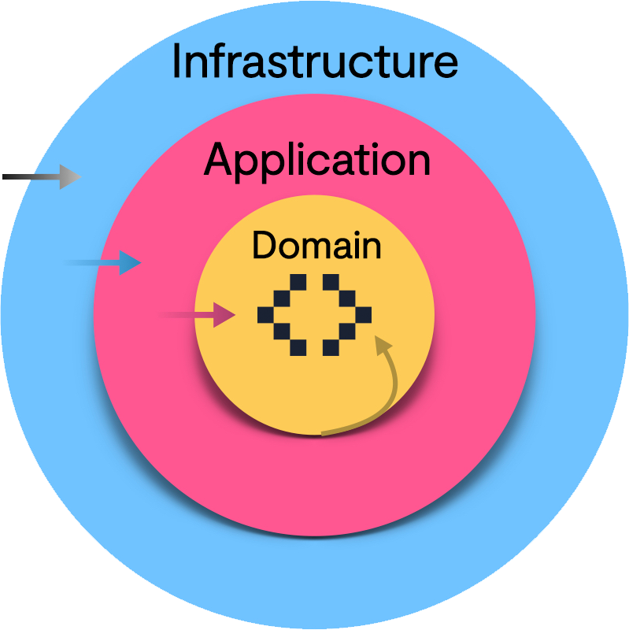

**Infraestructura**

    Tot allò que sigui tecnologia o que sigui d'entrada o sortida: Bases de dades, APIs, MatplotLib, Bokeh, etc.

**Aplicació**

    On s'implementen els casos d'ús: CrearUsuari, ObtenirUsuaris, ...
    Gestionar errors i publicar events

**Domini**

    On hi ha les entitats i la lògica de negoci. També les interfaces

# Comandes a recordar:

## Backend

**inicialitzar backend:**
    docker compose build (si cal)
    docker compose up

**Veure prints backend:**
    docker compose logs -f web

**entrar al shell del container:**
    docker compose exec web bash

**tests backend:**
    pytest

**entrar shell django:**

    (desde el shell del container)
    python manage.py shell_plus

## Frontend

**inicialitzar servidor:**
    npm run serve

**tests frontend:**
    npm test

